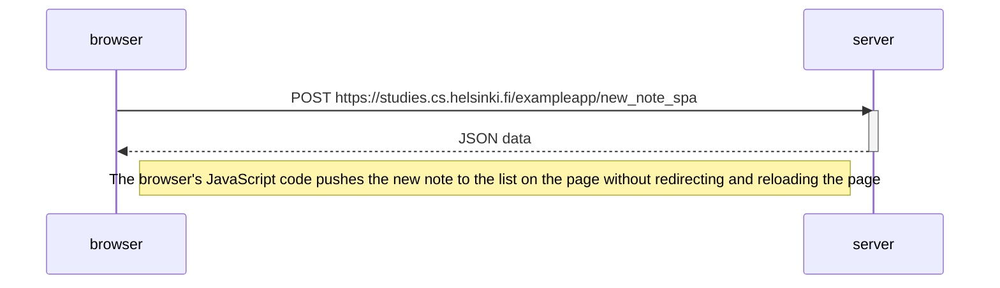

```mermaid
sequenceDiagram
    participant browser
    participant server
    
    browser->>server: POST https://studies.cs.helsinki.fi/exampleapp/new_note_spa
    activate server
    server-->>browser: JSON data
    deactivate server

    Note left of server: The browser's JavaScript code pushes the new note to the list on the page without redirecting and reloading the page

```
